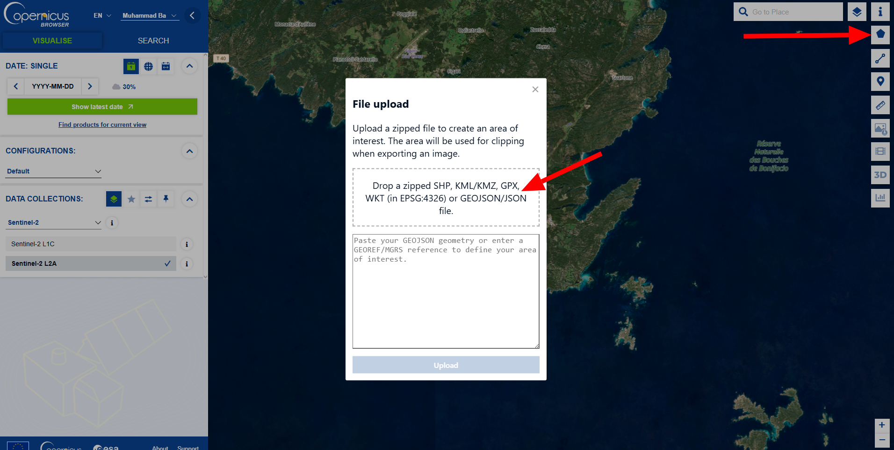
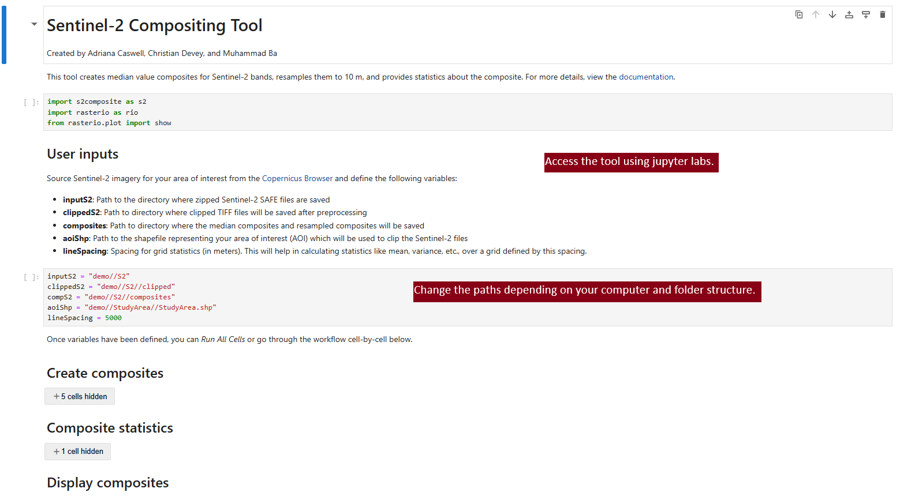

# Sentinel-2 Compositing Tool Demo

Created by **Adriana Caswell**, **Christian Devey**, and **Muhammad Ba**

This demo showcases the **Sentinel-2 Compositing Tool**, designed to streamline the process of working with Sentinel-2 imagery. The tool generates **median value composites** from multi-temporal Sentinel-2 data, resamples them to a consistent 10m resolution, and performs various statistical analyses to provide insights into the data. This can be useful for monitoring vegetation, land use, and other environmental factors over time.

### Demo Data
The demo is pre-configured with a set of **demo data** that can be used to test the tool. The demo data includes:

- **StudyArea.shp**: Defines the area of interest (AOI) for analysis.
- **Sentinel-2 Imagery**: The corresponding Sentinel-2 images aligned with the study area, which are provided in the `demo/S2` folder along with a text file listing the required imagery and download links.

### Running The Tool
The tool automates the preprocessing, compositing, and analysis tasks, saving valuable time and ensuring reproducibility. The process includes:

- **Preprocessing**: Clipping Sentinel-2 SAFE files to the AOI and converting them to the appropriate format.
- **Compositing**: Creating median value composites to summarize multi-temporal data into a single image.
- **Resampling**: Rescaling the image resolution to 10m for consistency.
- **Statistical Analysis**: Calculating key statistics such as mean and variance over defined grid areas.

Once you run the tool, it will automatically execute all necessary steps in sequence, from data preprocessing to the final visualization and statistical analysis, making it user-friendly and efficient. However, if you prefer, you can also run each cell individually to have more control over the process and explore the results at each step. 

Throughout this guide, we will provide **screenshots** for each step to help you visualize the process and ensure everything is set up correctly. This tool is especially valuable for researchers and practitioners working with satellite data who need to quickly and accurately analyze large datasets.

By the end of this demo, you will have learned how to use the tool wiht the provided `demo/S2`, also customize inputs, and interpret the resulting output, enabling you to apply it to your own Sentinel-2 data for environmental monitoring and analysis.


---

## Installation

1. Clone the repository:
   ```
   git clone https://github.com/GEOM4009/W25Project_Compositing.git
   ```

2. Install [Anaconda](https://www.anaconda.com/download#Downloads) if you haven’t already.

3. Navigate to the cloned directory and create a Conda environment:
   ```
   conda env create -f s2compo_env.yml
   ```

4. Activate the environment:
   ```
   conda activate s2compo
   ```

5. Open the Sentinel-2 Compositing Tool:
   ```
   jupyter lab S2CompoTool.ipynb
   ```
## Demo Data Setup

In the `demo/S2` folder, you will find a text file that outlines the specific Sentinel-2 imagery used in the demo. This file provides detailed information on the imagery aligned with the study area, ensuring that the selected satellite data matches the area of interest for your analysis. The images have already been downloaded and are pre-organized in the folder, so there is no need for you to manually download or save any additional files.

Additionally, the `StudyArea.shp` file is already included in this folder. This shapefile defines the Area of Interest (AOI) for the analysis, which is used to clip the Sentinel-2 imagery. Since the AOI is pre-configured to match the study area, you don’t need to make any modifications. However, if you want to analyze a different region, you can replace this shapefile with one that corresponds to a new AOI.

The `demo/S2` folder is already set up with all the necessary files, and the tool is configured to automatically detect and use them during the preprocessing, compositing, and analysis steps. This setup ensures that you can run the demo without any additional configuration or file management.

## Downloading your own Sentinel-2 Imagery
First, download Sentinel-2 data from the [Copernicus Browser](https://dataspace.copernicus.eu/explore-data/data-collections/sentinel-data/sentinel-2).




# Getting Started

### 2. Set Up User Inputs
In this section, you will define the paths and other settings necessary for the tool to run properly. These variables control the location of your Sentinel-2 data, the clipped data, and where your output files will be saved. Make sure to adjust the paths according to your system and data storage locations.


### 3. In the **S2CompoTool.ipynb Notebook**, define the necessary input variables:

```python
inputS2 = "demo/S2"
clippedS2 = "demo/S2/clipped"
compS2 = "demo/S2/composites"
aoiShp = "demo/S2/StudyArea.shp"
lineSpacing = 5000
```



These paths should be adjusted based on your own paths.

### 4. Run the Tool
Once the variables are set, you can **Run All Cells** or **One at a time** in the Jupyter Notebook, and the tool will automatically execute all steps from preprocessing to visualization and statistical analysis.

---

# Steps Of The Tool

### Step 1 : Preprocessing
Clip Sentinel-2 SAFE files to the Area of Interest (AOI) and convert them to TIFF format:
```python
s2.prepS2(inputS2, aoiShp, clippedS2)
```
This step will create clipped TIFFs, which I will show in a screenshot.

### Step 2 : Create Composites
The tool generates **median value composites** and resamples them to 10m resolution:
```python
bands, meta10m, meta20m, meta60m = s2.sortBands(clippedS2)
s2.compositeBands(bands, meta10m, meta20m, meta60m, compS2)
composites = s2.resampleBandsTo10m(compS2, overwrite = False)
```


### Step 3 and 4 : Generate Composite Statistics & Display Composites
The tool calculates key statistics, such as mean and variance, over a grid defined by `lineSpacing`:
```python
stats = s2.gridStats(bands, lineSpacing)
```
To visualize the composite bands:
```python
s2.showBands(composites)
```


### Step 5 :To generate an RGB composite:
```python
R = "demo/S2/composites/B04_resampled_10m.tif"
G = "demo/S2/composites/B03_resampled_10m.tif"
B = "demo/S2/composites/B02_resampled_10m.tif"
s2.showRGB(R, G, B)
```

### Step 6 :To display a single band:
```python
boi = "demo/S2/composites/B01_resampled_10m.tif"
with rio.open(boi) as src:
    show(src)
```


---
## Troubleshooting

If you encounter issues, try the following solutions:

### 1. **File Not Found**
   - **Solution**: Ensure the paths for the Sentinel-2 data (`inputS2`) and AOI shapefile (`aoiShp`) are correct. Check for typos, extra spaces, and correct file extensions (.SAFE for Sentinel-2 and .shp for shapefiles).

### 2. **Incorrect Paths**
   - **Solution**: Double-check paths in the **User Inputs** section. Use double backslashes (`\\`) or single forward slashes (`/`) for Windows paths.

### 3. **Memory Issues**
   - **Solution**: Try reducing the AOI size or processing fewer bands to lower memory usage. Check system RAM and available space.

### 4. **Output Files Not Generated**
   - **Solution**: Verify the output directories are correct and writeable. Check for errors during execution to diagnose any issues.


### If problems persist, contact project contributors or consult the **Credits** section for further help.

---

## Credits
- **Adriana Caswell, Christian Devey, and Muhammad Ba** for developing the tool, including the design, coding, and testing of the Sentinel-2 Compositing Tool. We contributed to the development of key features, troubleshooting, and documentation to ensure a seamless user experience.
- **Dr. Derek Mueller** for providing valuable guidance throughout the project, offering feedback, and ensuring that the tool's functionalities align with the project’s goals.
- **Dr. Anders Knudby** for his support and insights into the project's direction, helping us refine the tool and incorporate best practices in geospatial analysis and compositing.

---


